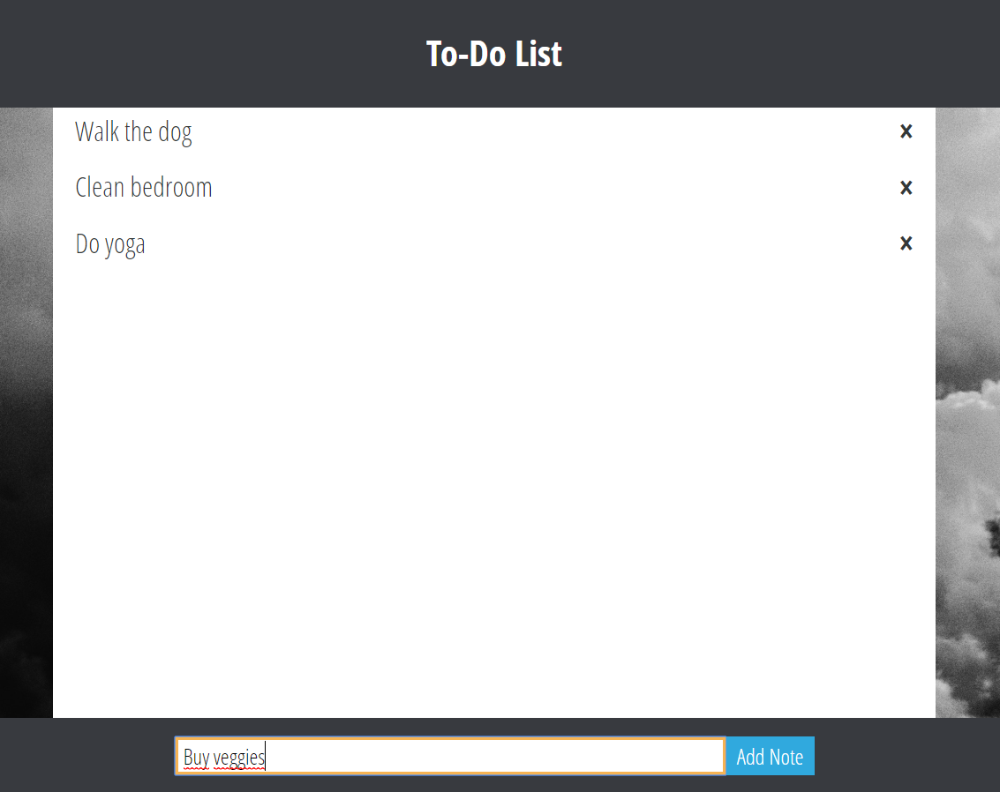
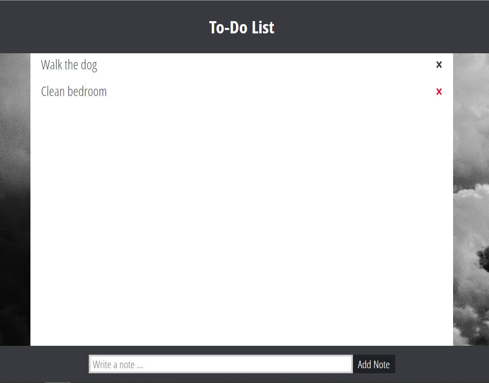
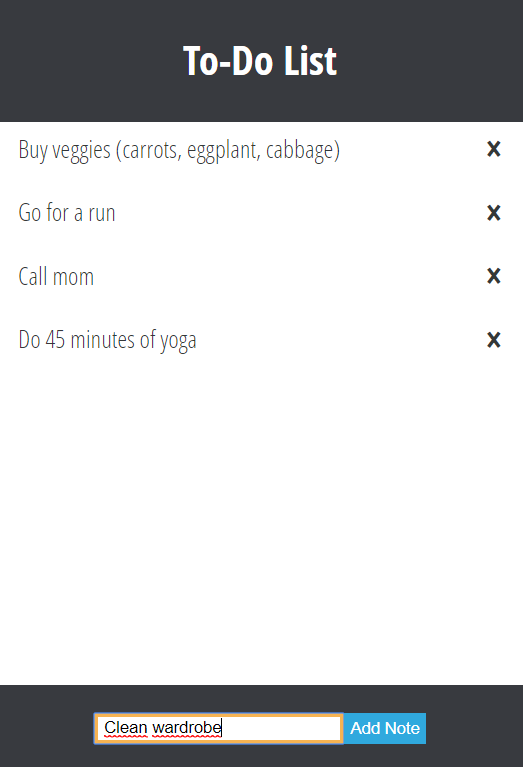

# React & Firebase To-do list
> Here goes your awesome project description!

## Table of contents
* [General info](#general-info)
* [Screenshots](#screenshots)
* [Technologies](#technologies)
* [Features](#features)
* [Status](#status)
* [Inspiration](#inspiration)
* [Contact](#contact)

## General info
 A simple to-do list created in order to practice working with React.js and firebase.

## Screenshots

## Technologies
* JavaScript - ECMAScript 6
* React.js - version 16.5.2
* Firebase - version 5.5.5
* SASS
* RWD

## Features
List of features ready and TODOs for future development
* Adding notes to the to-do list
* Deleting notes from the to-do list

To-do list:
* More styling needed

## Status
Project is: _in progress_

## Inspiration
Project inspired and based on [@wesdoyle](https://github.com/wesdoyle/react-firebase-notes-app)

## Contact
Created by [@magdalenafronczyk](https://github.com/MagdaFronczyk) - feel free to contact me!